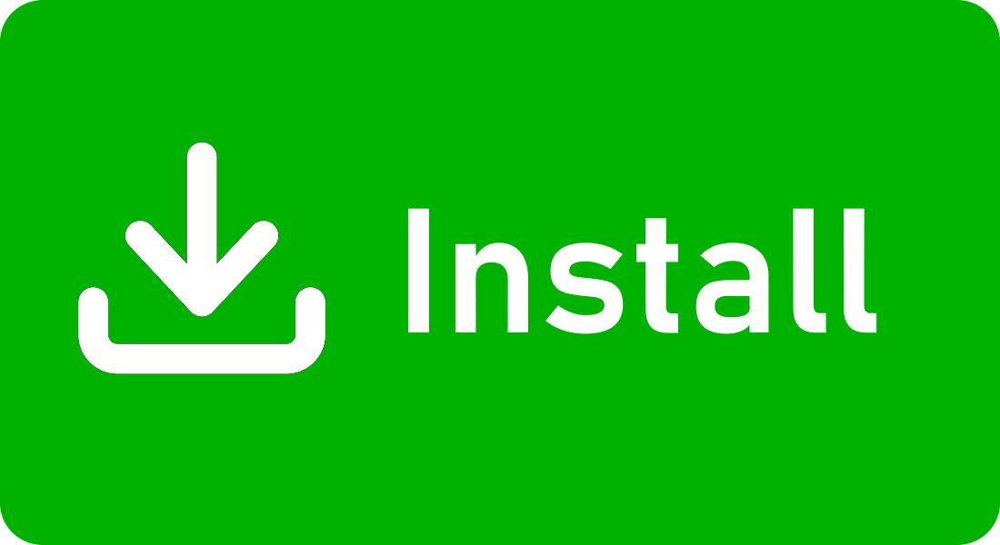
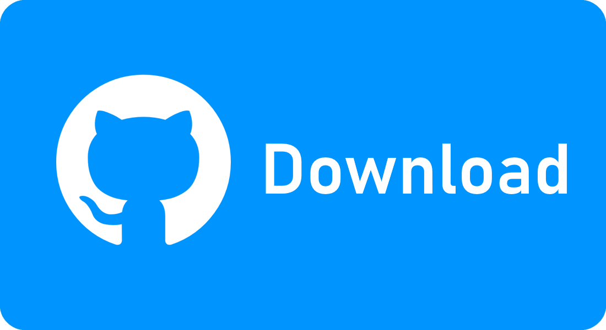

</img>
# Steam Update Plugin
<a href="https://playnite.link/addons.html#SteamUpdate_e9ecfc93-b000-4439-8dd8-a52b7b887a43"></img></a>
<a href="https://github.com/odeyity/Playnite-Steam-Update-Plugin/releases/download/1.0.0/SteamUpdate_e9ecfc93-b000-4439-8dd8-a52b7b887a43_1_0_0.pext"></img></a>

On Playnite startup, this C# plugin simply opens a python script compiled into an executable that reads appmanifest data for Steam and alerts the user of any games that have updates.
#
🔆Future additions checklist: 
- [ ] Epic Games support
- [ ] Rewrite of plugin to be fully C# 
- [ ] Theme integration 
- [ ] Display download status 

Screenshots: 

Used: 
- PyInstaller - For compiling the python script into an executable 
- Visual Studio 2022 - For debugging and building the C# plugin 
- Visual Studio Code - For writing the python script

-----------------------------------------------------------------------------
